# Example of distribution in R

Links:

* [All types of distribution on www.math.wm.edu](
http://www.math.wm.edu/~leemis/chart/UDR/UDR.html)
* [Packages with distribution function](http://stat.ethz.ch/R-manual/R-patched/library/stats/html/Distributions.html)
* [Probability Distribution on Cran](https://cran.r-project.org/doc/manuals/R-intro.html#Probability-distributions)
* [how to math in knitr](https://es.sharelatex.com/learn/List_of_Greek_letters_and_math_symbols)

Build in distribution: Normal, Poisson, Binomial, Exponential, Gamma, etc.

### R prefixes for distribution

* __d__ - returns the height of the probability density function
* __p__	- returns the cumulative density function (cumulative distirbution)
* __q__	- returns the inverse cumulative density function (quantiles)
* __r__	- returns randomly generated numbers

___

### Uniform (Rectangular) Distribution


```r
numcases <- 1e4
min <- 1                                 
max <- 6
x <- as.integer(runif(numcases, min, max+1))
c(min=min(x), max=max(x))
```

```
## min max 
##   1   6
```

```r
hist(x, breaks=seq(min-.5, max+.5, 1))
```

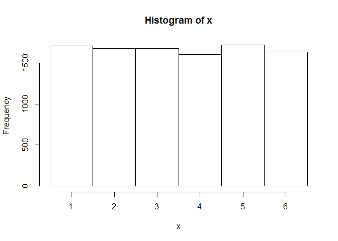 

___

### Normal (Gaussian) Distribution

Simple rule: 

* 68% of the data falls within 1 standard deviation of the mean
* 95% of the data falls within 2 standard deviations of the mean
* 99.7% of the data falls within 3 standard deviations of the mean


```r
# "rnorm" function with truncation to min and max values
rtnorm <- function(n, mean, sd, a = -Inf, b = Inf){
    qnorm(runif(n, pnorm(a, mean, sd), pnorm(b, mean, sd)), mean, sd)
}

numcases <- 1e6
min = -4
max = 4
set.seed(1)
x <- rtnorm(numcases, mean=0, sd=1, min, max)
c(min=min(x), max=max(x))
```

```
##       min       max 
## -3.998846  3.987980
```

```r
set.seed(1)
x2 <- rnorm(numcases, mean=0, sd=1)
c(min=min(x2), max=max(x2))
```

```
##       min       max 
## -4.882127  4.650944
```

```r
s <- seq(-5, 5, 0.1)
plot(s, dnorm(s, mean=0, sd=1), # type="l",
     xlim=c(min, max),
     main = "Density")
```

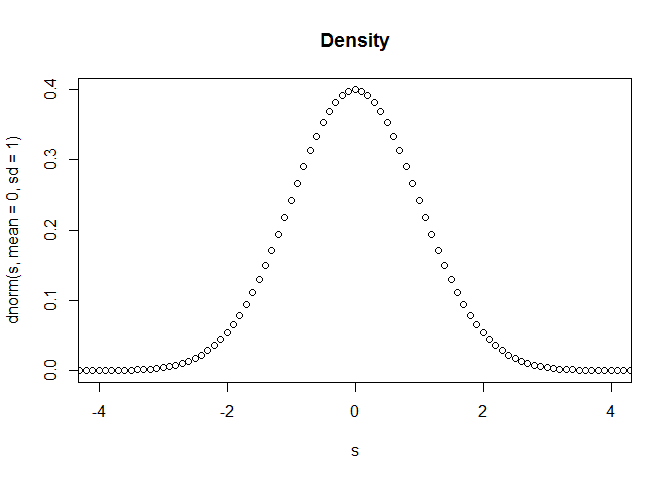 

```r
hist(x, breaks=100,
     xlim=c(min, max),
     main="Normal (Gaussian) Distribution")
```

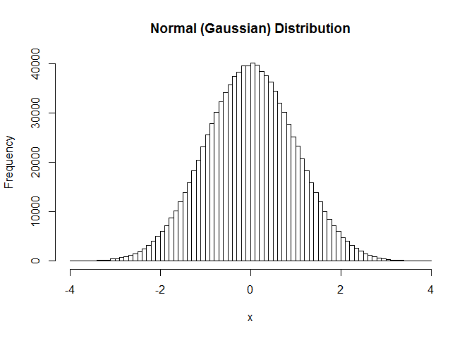 

___
### The t Distribution (Student's t)


```r
x <- seq(-5,5,0.1)
plot(x, dt(x, df=10),
    xlim=c(-10, 10),
    main="Density")
```

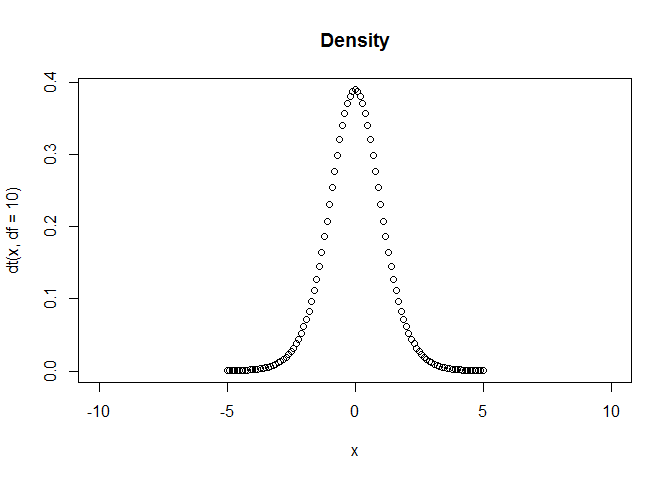 

```r
hist(rt(1e6, df=10), 
     xlim=c(-10, 10),
     breaks=100)
```

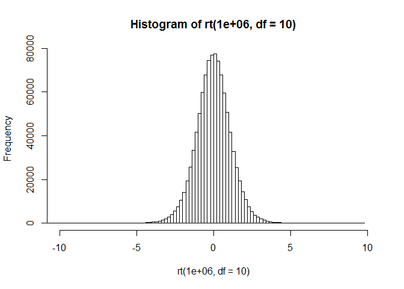 

___

### Poisson Distribution


```r
hist(rpois(1e6,10), breaks=100)
```

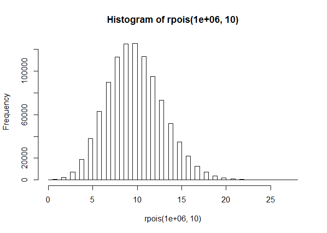 

```r
hist(rpois(1e6,c(20,100)), breaks=1000)
```

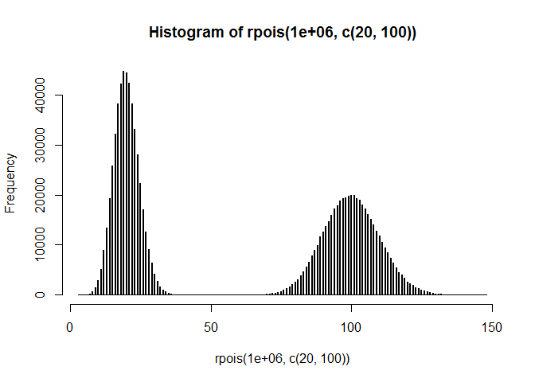 

---

### Binomial Distribution


```r
x <- seq(0, 100, 1)
plot(x, dbinom(x, 100, 0.5),
     xlim=c(0, 100),
     main="Density")
```

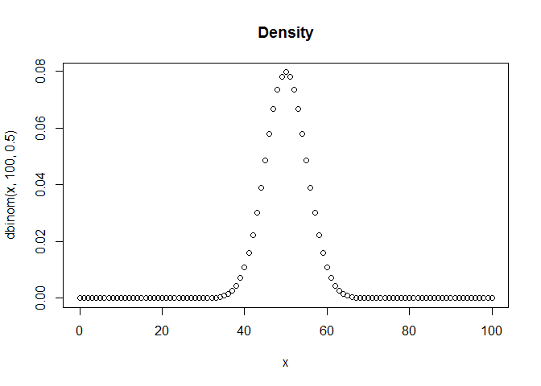 

```r
hist(rbinom(1e6, 100, 0.5), breaks=50,
     xlim=c(0, 100),
     main="Binomial Distribution")
```

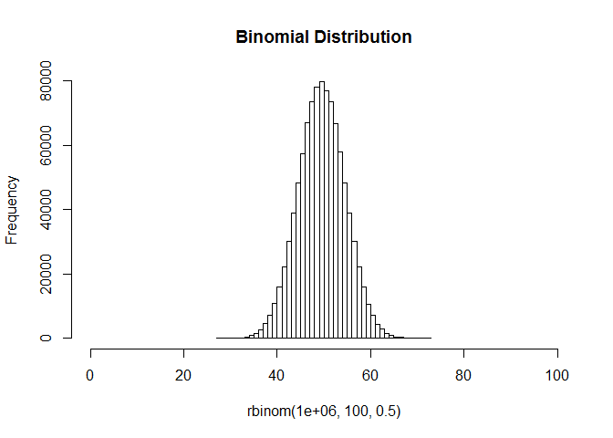 

___

### Log Normal Distribution

>The log-normal distribution is a probability distribution of a random variable whose logarithm is normally distributed.


```r
x <- rlnorm(100, meanlog=0, sdlog=1)
s <- seq(0, max(x), 0.1)
d <- dlnorm(s, meanlog=0, sdlog=1)

hist(x, prob=T,
     col=gray(0.9), ylim=c(0, max(d)),
     breaks=20)

lines(density(x), lty=2)
curve(dlnorm(x, meanlog=0, sdlog=1), lwd=2, add=T, col="steelblue")
rug(x)
```

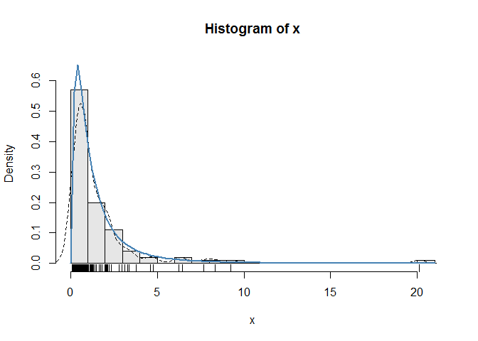 


```r
boxplot(x, horizontal=T, bty="n", main="log-normal distribution")
```

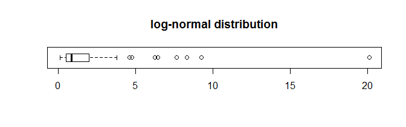 


___
### Simulate Linear Model


Example for the following linear model:

$$y = \beta_0 + \beta_1 * x + \varepsilon$$

where $\varepsilon \sim N(0,2^2)$. Assume $x \sim N(0,1^2)$, $\beta_0 = 0.5$ and $\beta_1 = 2$.


```r
set.seed(20)
x <- rnorm(100)
e <- rnorm(100, 0, 2)
y <- 0.5 + 2*x + e
plot(x, y, main="Linear Model")
```

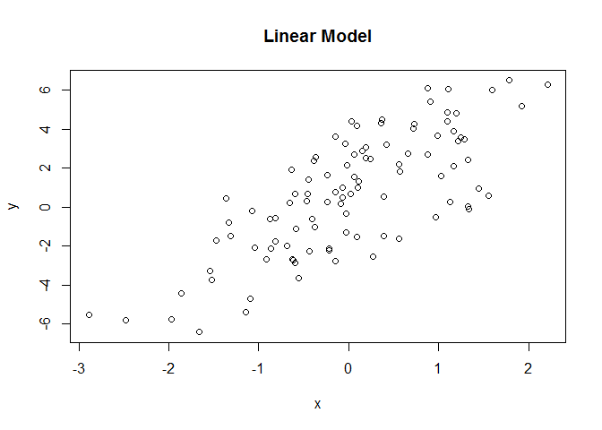 

___
### Simulate Binary Linear Model


```r
set.seed(20)
x <- rbinom(100, 1, 0.5)
e <- rnorm(100, 0, 2)
y <- 0.5 + 2*x + e
plot(x, y, main="Binary Linear Model")
```

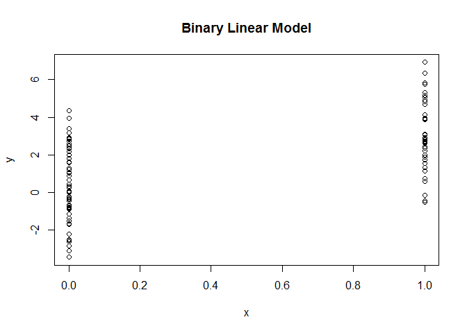 

### Simulate Poisson Model

Suppose our model to simulate from the Poisson model, where:

$$Y \sim \text{Poisson}(\mu)$$

$log \mu = \beta_0 + \beta_1x$

and $\beta_0 = 0.5$ and $\beta_1 = 0.3$.


```r
set.seed(1)
x <- rnorm(100)
log.mu <- 0.5 + 0.3 * x
y <- rpois(100, exp(log.mu))
plot(x, y, main="Poisson Model")
```

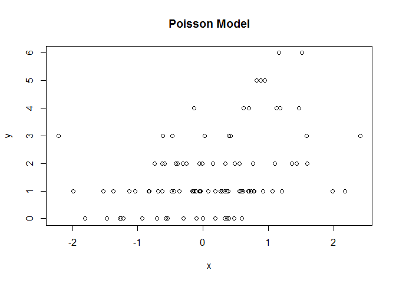 
