# Simulation of Pi

****

## Egg

Egg equation: 

$$\begin{equation} \begin{cases} x = a*\cos(\theta)\\ y = b*\cos(\frac{\theta}{4})*\sin(\theta)\\
\theta\leq\pi \end{cases} \end{equation}$$

$$\documentclass{amsart} 
\begin{document}
\begin{eqnarray} 
\tau_G(g) = \left\{
            \begin{array}{ll}
            a & b \\
            {[}G & l
            \end{array}
            \right.
\end{eqnarray}
\end{document}$$


```r
t = seq(-pi, pi, by = 0.01)
H = 1
y = H * 0.78 * cos(t/4) * sin(t)
x = -H * cos(t)
par(mar = rep(0, 4))
plot(x, y, type = "l", 
     xlim = c(-1, 1), ylim = c(-1, 1), 
     asp = 1, col = "orange1", lwd = 5, axes = FALSE)
```

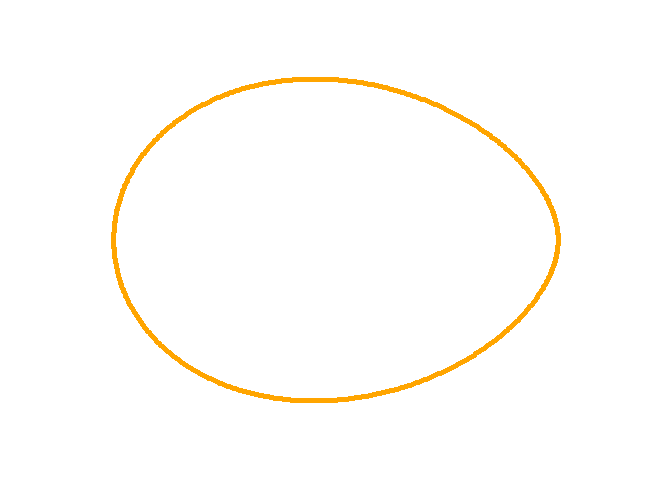 

[Rotation matrix](https://en.wikipedia.org/wiki/Rotation_matrix)

$$R(\theta)= \begin{equation} \left[
  \begin{array}{cc}
    \cos\theta & -\sin\theta\\
    \sin\theta & \cos\theta\\
  \end{array}
\right] \end{equation}$$


```r
angle <- 90*pi/180 # 90 degrees in radians
x1 <- cos(angle) * x - sin(angle) * y
y1 <- sin(angle) * x + cos(angle) * y
par(mar = rep(0, 4))
plot(x1, y1, type = "l", 
     xlim = c(-1, 1), ylim = c(-1, 1), 
     asp = 1,   col = "orange1", lwd = 5, axes = FALSE)
```

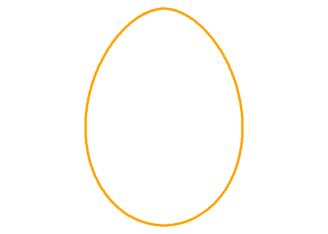 


****

## Plot equation


```r
f <- function(x, y) x^2 - 3*y^2 + 2*x*y - 20
x <- y <- seq(-10, 10, length=100)
z <- outer(x, y, f)
contour(
  x=x, y=x, z=z, 
  levels=0, las=1, drawlabels=FALSE, lwd=2
)
```

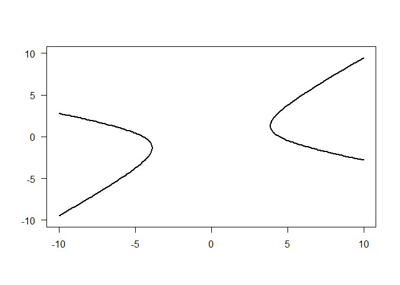 

```r
f <- function(x, y) x^2 + y^2 - 30
x <- y <- seq(-10, 10, length=100)
z <- outer(x, y, f)
contour(
  x=x, y=x, z=z, 
  levels=0, drawlabels=FALSE, lwd=2, asp=1
)
```

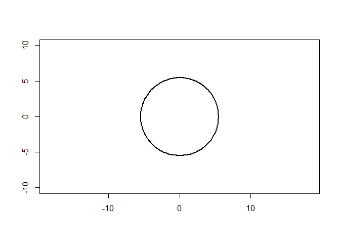 

```r
x <- seq(-3,3,length.out=100)
y <- seq(-3,3,length.out=100)
z <- outer(x^2, y^2, `+`)
persp(x, y, z, col='blue')
```

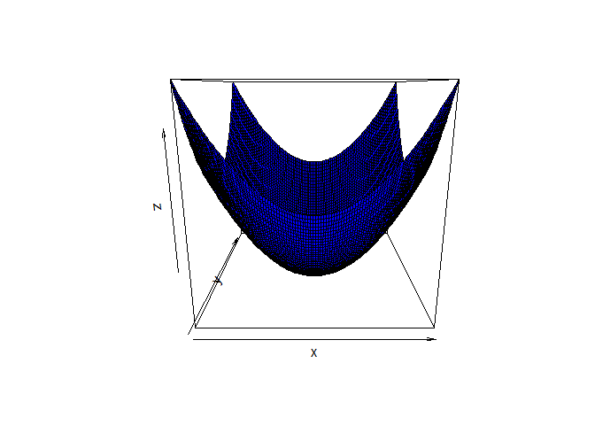 

```r
#oldMar <- par("mar")
#par(mar=c(1,1,1,1))
#layout(matrix(1:4, nrow=2))
#s=lapply(c(0,30,60,90), function(t) persp(x,y,z, col='blue', #theta=t))

#par(mar=oldMar)
#layout(matrix(1:1, nrow=1))
#image(z)
```

****

## Simple plot


```r
n <- 5e4 
x <- rnorm(n); y <- rnorm(n)
inside <- x^2 + y^2 <= 1 # (a-x)^2 + (b-x)^2 <= radius^2; # a, b are center point


plot(x, y, col=ifelse(inside, "red", "blue"), pch=".", 
     xlim=c(-2,2), ylim=c(-2,2),  asp = 1)
```

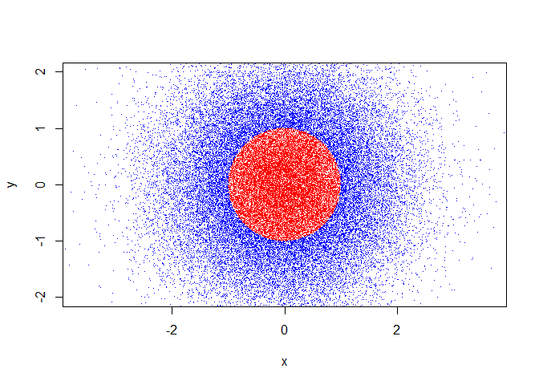 

```r
inside <- x^2 + ((1.4^x)*(1.6*y))^2 <= 1

plot(x, y, col=ifelse(inside, "red", "blue"), pch=".", 
     ylim=c(-1.5, 1.5), xlim=c(-1.5, 1.5),  asp = 1)
```

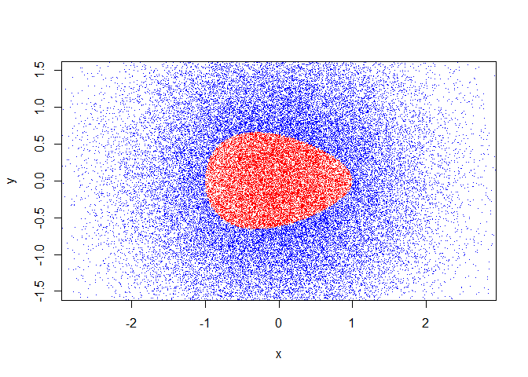 

****

## Simple circle


```r
# initialie a plot
plot(c(-1, 1), c(-1, 1), type = "n", asp = 1)

# prepare "circle data"
radius <- 1
theta <- seq(0, 2 * pi, length = 200)

# draw the circle
# for a circle with origin (j, k) and radius r:
# x(t) = r cos(t) + j      
# y(t) = r sin(t) + k
lines(x = radius * cos(theta), y = radius * sin(theta))
```

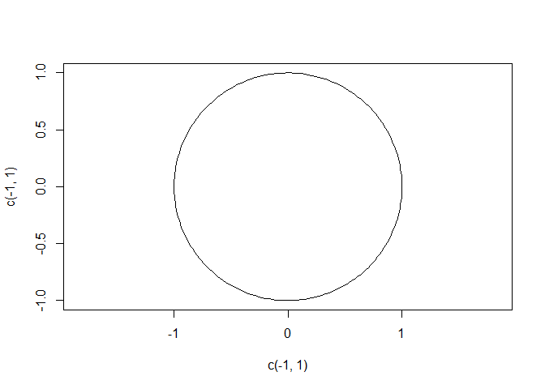 

****

## Simple Pie Chart


```r
# Simple Pie Chart
slices <- c(10, 12,4, 16, 8)
lbls <- c("US", "UK", "Australia", "Germany", "France")
pie(slices, labels = lbls, main="Pie Chart of Countries")
```

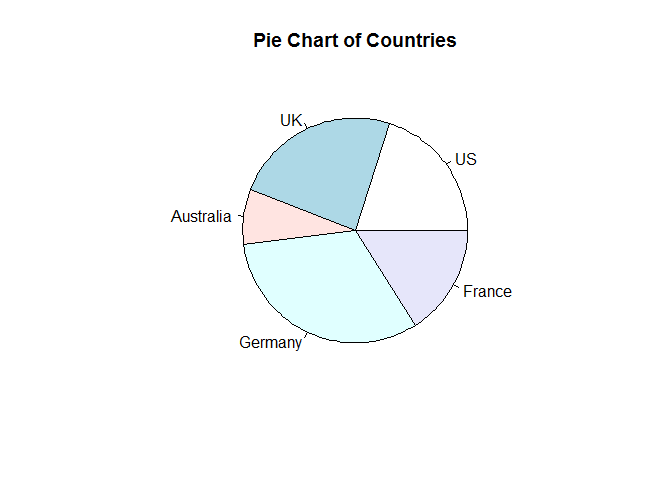 

```r
# Pie Chart with Percentages
slices <- c(10, 12, 4, 16, 8) 
lbls <- c("US", "UK", "Australia", "Germany", "France")
pct <- round(slices/sum(slices)*100)
lbls <- paste(lbls, pct) # add percents to labels 
lbls <- paste(lbls,"%",sep="") # ad % to labels 
pie(slices,labels = lbls, col=rainbow(length(lbls)),
  	main="Pie Chart of Countries")
```

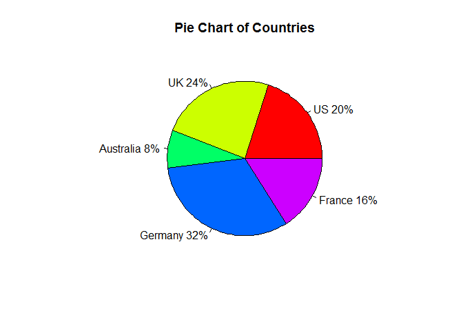 

```r
# 3D Exploded Pie Chart
library(plotrix)
slices <- c(10, 12, 4, 16, 8) 
lbls <- c("US", "UK", "Australia", "Germany", "France")
pie3D(slices,labels=lbls,explode=0.1,
  	main="Pie Chart of Countries ")
```

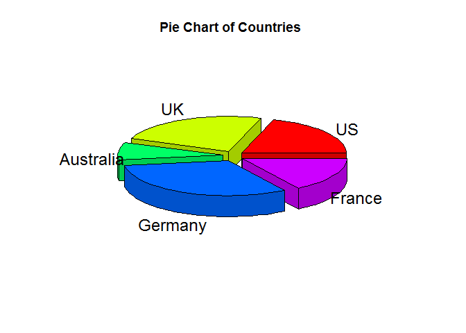 

****

## Calculate Pi


```r
n <- 1e6
x <- runif(n); y <- runif(n)
inside <- x^2 + y^2 <= 1
pi <- 4 * sum(inside) / n
idx <- sample.int(trunc(n/(log(n))), replace = FALSE)
x <- x[idx]; y <- y[idx];
inside <- inside[idx]

plot(x, y, 
     col=ifelse(inside, "blue", "red"), cex=0.5, pch=".",  
     main=sprintf("Bootstrap approximation of pi\nusing %s random samples, pi ~ %1.5f", n, pi))
```

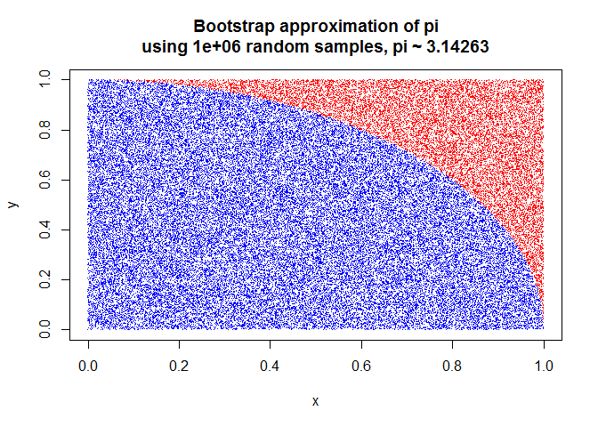 
