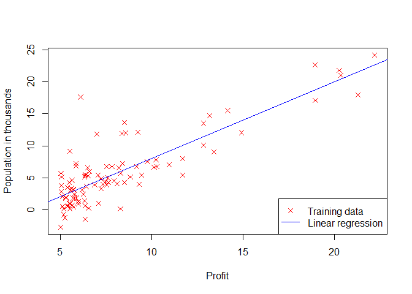
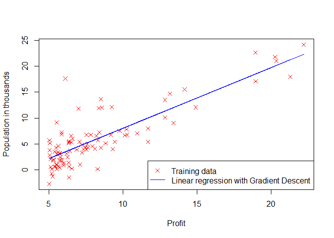

# Gradient Descent with R


## Linear Regression with One Variable


```r
data <- read.table("./data/ex1data1.txt", sep=",", header = FALSE)
colnames(data) <- c('Population','Profit')
head(data)
```

```
##   Population  Profit
## 1     6.1101 17.5920
## 2     5.5277  9.1302
## 3     8.5186 13.6620
## 4     7.0032 11.8540
## 5     5.8598  6.8233
## 6     8.3829 11.8860
```

```r
X <- data[, 1]
y <- data[, 2]
m <- length(y)
plot(X, y, pch=4, col="red", ylab="Population in thousands", xlab="Profit")
abline(lm(y~X), col="blue")
legend("bottomright", 
       legend = c("Training data", "Linear regression"), 
       col=c("red","blue"), lwd=1, lty=c(NA,1), pch=c(4, NA))
```

 

```r
# Add a column of ones to x
X <- matrix(c(rep(1,length(X)),X), ncol=2)
head(X)
```

```
##      [,1]   [,2]
## [1,]    1 6.1101
## [2,]    1 5.5277
## [3,]    1 8.5186
## [4,]    1 7.0032
## [5,]    1 5.8598
## [6,]    1 8.3829
```

```r
# Initialize fitting parameters
theta <- rep(0,2) ## n=2

# Some gradient descent settings
iterations <- 1500
alpha <- 0.01

computeCost <- function (X, y, theta){
    # number of training examples
    m <- length(y);
    # need to return
    J <- 0;
    
    predictions <-  X %*% theta;
    sqerrors = (predictions - y)^2;
    J = 1/(2*m)* sum(sqerrors);
    
    J
}

computeCost(X, y, theta)
```

```
## [1] 32.07273
```

```r
gradientDescent <- function(X, y, theta, alpha, num_iters){
    m <- length(y);  
    J_history = rep(0, num_iters);
    for (iter in 1:num_iters){
        predictions <-  X %*% theta;
        updates = t(X) %*% (predictions - y);
        theta = theta - alpha * (1/m) * updates;
        J_history[iter] <- computeCost(X, y, theta);
    }
    list("theta" = theta, "J_history" = J_history)  
}

# run gradient descent
gradientResult <- gradientDescent(X, y, theta, alpha, iterations);
theta <- gradientResult$theta

plot(X[,2], y, pch=4, col="red", 
     ylab="Population in thousands", 
     xlab="Profit")
lines(X[,2], X%*%theta, col="blue")
legend("bottomright", 
       legend = c("Training data", 
                  "Linear regression with Gradient Descent"), 
       col=c("red","blue"), lwd=1, lty=c(NA,1), pch=c(4, NA))
```

 

### Now we can make predictions


```r
predict1 <- c(1, 3.5) %*% theta
predict2 <- c(1, 7) %*% theta
```

* For population 35,000, we predict a profit of __4519.767868__
* For population 70,000, we predict a profit of __45342.450129__
