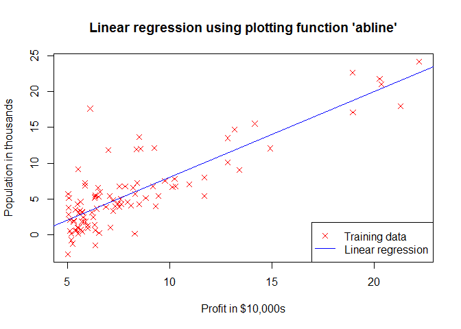
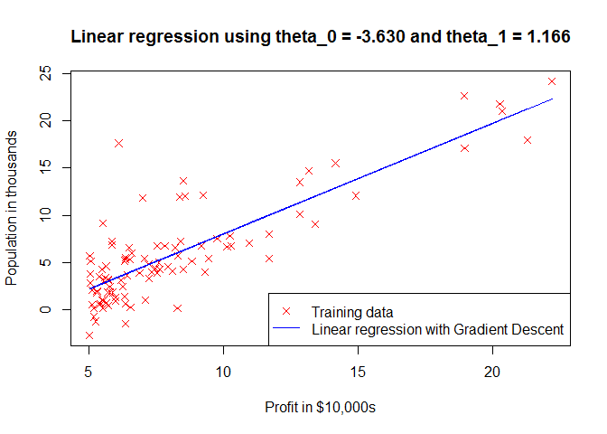

# Gradient Descent with R


## Linear Regression with One Variable


### Load data


```r
data <- read.table("./data/ex1data1.txt", sep=",", header = FALSE)
colnames(data) <- c('Population','Profit')
head(data)
```

```
##   Population  Profit
## 1     6.1101 17.5920
## 2     5.5277  9.1302
## 3     8.5186 13.6620
## 4     7.0032 11.8540
## 5     5.8598  6.8233
## 6     8.3829 11.8860
```

```r
X <- data[, 1]
y <- data[, 2]
m <- length(y)
print("number of training examples");print(m)
```

```
## [1] "number of training examples"
```

```
## [1] 97
```


### Show loaded data


```r
plot(X, y, pch=4, col="red", ylab="Population in thousands", xlab="Profit in $10,000s",
     main = "Linear regression using plotting function 'abline'")
abline(lm(y~X), col="blue")
legend("bottomright", 
       legend = c("Training data", "Linear regression"), 
       col=c("red","blue"), lwd=1, lty=c(NA,1), pch=c(4, NA))
```

 


### The Hypothesis Function

Hypothesis function in general form: $h_\theta(x) = \theta_0 + \theta_1 x$

**Example:**

Given: first row from training set $x_1 = 2, y_1 = 10$

Now we can randomly iterate through $\theta_0$ and $\theta_1$.

So that $h_\theta$ for $\theta_0=3$ and $\theta_1=5$ becomes:

$h_\theta(x) = 3 + 5 x,$

and for given $x_1 = 2$ our $h_\theta = 13$. It's greater by 3 from $y_1$.

**Same example with R:**

Hypothesis function is represented as: $h_\theta(x) = \theta_0 x_0 + \theta_1 x_1$, where $x_0 = 1$ all times for matrix multiplication.


```r
theta <- c(3, 5)
x1 <- c(1, 2) # add 1 as x_0
# find h_theta
h <- x1 %*% theta 
print(paste("h =", h[1]))
```

```
## [1] "h = 13"
```

```r
# or we can calculate h for all training set at once
x <- matrix(c(rep(1, 3), c(10,20,30)), ncol=2)
x
```

```
##      [,1] [,2]
## [1,]    1   10
## [2,]    1   20
## [3,]    1   30
```

```r
x %*% theta
```

```
##      [,1]
## [1,]   53
## [2,]  103
## [3,]  153
```

**Add column with $x_0$ for all training set**


```r
# Add a column of ones to x
X <- matrix(c(rep(1,length(X)),X), ncol=2)
head(X)
```

```
##      [,1]   [,2]
## [1,]    1 6.1101
## [2,]    1 5.5277
## [3,]    1 8.5186
## [4,]    1 7.0032
## [5,]    1 5.8598
## [6,]    1 8.3829
```

## Cost Function

This function is also known as "Squared error function", or "Mean squared error".

$J(\theta_0, \theta_1) = \dfrac {1}{2m} \displaystyle \sum _{i=1}^m \left (h_\theta (x_{i}) - y_{i} \right)^2$


```r
computeCost <- function (X, y, theta){
    # number of training examples
    m <- length(y);
    # need to return
    J <- 0;
    
    predictions <-  X %*% theta;
    sqerrors = (predictions - y)^2;
    J = 1/(2*m)* sum(sqerrors);
    
    J
}
```

**Example:**

Given:

$x_1 = 2, y_1 = 10, m = 1$

$\theta_0=3, \theta_1=5$:

$h_\theta(x) = 3 + 5 x,$

for given $x_1 = 2$, our $h_\theta = 13$. 

It's greater by 3 from $y_1$.


$J(3, 5) = \dfrac {1}{2 * 1} \displaystyle \sum _{i=1}^1 \left (13 - 10 \right)^2 = \dfrac {9}{2} = 4.5$


```r
theta
```

```
## [1] 3 5
```

```r
x1
```

```
## [1] 1 2
```

```r
print(paste("J =", computeCost(x1, 10, theta)))
```

```
## [1] "J = 4.5"
```

## Gradient Descent

**Repeat until convergence:** 

$\begin{align*}
\lbrace & \newline 
\theta_0 := & \theta_0 - \alpha \frac{1}{m} \sum\limits_{i=1}^{m}(h_\theta(x_{i}) - y_{i}) \newline
\theta_1 := & \theta_1 - \alpha \frac{1}{m} \sum\limits_{i=1}^{m}\left((h_\theta(x_{i}) - y_{i}) x_{i}\right) \newline
\rbrace&
\end{align*}$

Where:

$m$ – size of training set,

$theta_0, theta_1$ – values to change **simultaneously**,

$x_i, y_i$ – items of training set,

$\alpha$ – step size.


```r
gradientDescent <- function(X, y, theta, alpha, num_iters){
    m <- length(y);  
    J_history = rep(0, num_iters);
    for (iter in 1:num_iters){
        predictions <-  X %*% theta;
        updates = t(X) %*% (predictions - y);
        theta = theta - alpha * (1/m) * updates;
        J_history[iter] <- computeCost(X, y, theta);
    }
    list("theta" = theta, "J_history" = J_history)  
}
```

**Example**


```r
theta <- c(0, 0)
iterations <- 1500
alpha <- 0.01
X.test <- matrix(c(1, 1, 3, 3), ncol=2)
y.test <- matrix(c(10, 10), ncol=1)
# answer must be 1,3
# h(1, 3) = 1 + 3*x = 1 + 3*3 = 10
result.test <- gradientDescent(X.test, y.test, theta, alpha, iterations)
result.test$theta
```

```
##      [,1]
## [1,]    1
## [2,]    3
```


## Start it all together

Let's run gradient descent on all training set, X - population, y - Profit.


```r
# Initialize 
theta <- c(0, 0)
iterations <- 1500
alpha <- 0.01

# run gradient descent
result <- gradientDescent(X, y, theta, alpha, iterations);
theta <- result$theta
print("theta found:");print(theta)
```

```
## [1] "theta found:"
```

```
##           [,1]
## [1,] -3.630291
## [2,]  1.166362
```


```r
title <- paste("Linear regression using theta_0 =", format(theta[1], digits = 3, nsmall=3))
title <- paste(title, "and theta_1 =", format(theta[2], digits = 3, nsmall=3))
plot(X[,2], y, pch=4, col="red", 
     ylab="Population in thousands", 
     xlab="Profit in $10,000s", 
     main=title)
lines(X[,2], X%*%theta, col="blue")
legend("bottomright", 
       legend = c("Training data", 
                  "Linear regression with Gradient Descent"), 
       col=c("red","blue"), lwd=1, lty=c(NA,1), pch=c(4, NA))
```

 

### Now we can make predictions


```r
predict1 <- c(1, 3.5) %*% theta
predict2 <- c(1, 7) %*% theta
```

* For population 35,000, we predict a profit of __4519.767868__
* For population 70,000, we predict a profit of __45342.450129__
