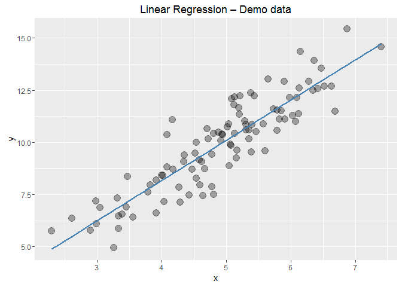
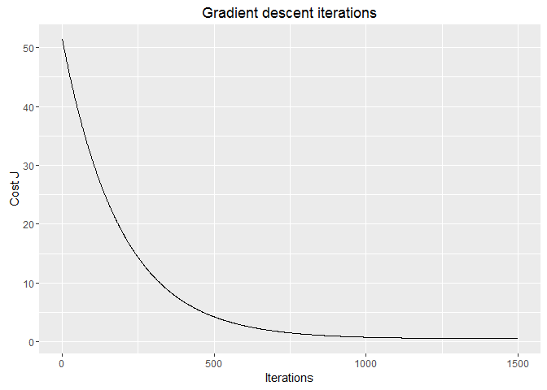

# Gradient Descent for Linear Regression with One Variable
Vladimir Kuznetsov  
December 2015  


# Linear Regression with One Variable

## The Hypothesis Function

Hypothesis function in general form: $h_\theta(x) = \theta_0 + \theta_1 x$

**Example:**

Given: first row from training set $x_1 = 2, y_1 = 10$

Now we can randomly iterate through $\theta_0$ and $\theta_1$.

So that $h_\theta$ for $\theta_0=3$ and $\theta_1=5$ becomes:

$h_\theta(x) = 3 + 5 x,$

and for given $x_1 = 2$ our $h_\theta = 13$. It's greater by 3 from $y_1$.

**Same example with R:**

Hypothesis function is represented as: $h_\theta(x) = \theta_0 x_0 + \theta_1 x_1$, where $x_0 = 1$ all times for matrix multiplication.


```r
theta <- c(3, 5)
x1 <- c(1, 2) # add 1 as x_0
# find h_theta
h <- x1 %*% theta 
print(paste("h =", h[1]))
```

```
## [1] "h = 13"
```

```r
# or we can calculate h for all training set at once
x <- matrix(c(rep(1, 3), c(10,20,30)), ncol=2)
x
```

```
##      [,1] [,2]
## [1,]    1   10
## [2,]    1   20
## [3,]    1   30
```

```r
x %*% theta
```

```
##      [,1]
## [1,]   53
## [2,]  103
## [3,]  153
```


## Cost Function

This function is also known as "Squared error function", or "Mean squared error".

$J(\theta_0, \theta_1) = \dfrac {1}{2m} \displaystyle \sum _{i=1}^m \left (h_\theta (x_{i}) - y_{i} \right)^2$


```r
computeCost <- function (X, y, theta){
    # number of training examples
    m <- length(y);
    # need to return
    J <- 0;
    
    predictions <-  X %*% theta;
    sqerrors = (predictions - y)^2;
    J = 1/(2*m)* sum(sqerrors);
    
    J
}
```

**Example:**

Given:

$x_1 = 2, y_1 = 10, m = 1$

$\theta_0=3, \theta_1=5$:

$h_\theta(x) = 3 + 5 x,$

for given $x_1 = 2$, our $h_\theta = 13$. 

It's greater by 3 from $y_1$.


$J(3, 5) = \dfrac {1}{2 * 1} \displaystyle \sum _{i=1}^1 \left (13 - 10 \right)^2 = \dfrac {9}{2} = 4.5$


```r
theta
```

```
## [1] 3 5
```

```r
x1
```

```
## [1] 1 2
```

```r
print(paste("J =", computeCost(x1, 10, theta)))
```

```
## [1] "J = 4.5"
```

## Gradient Descent

**Repeat until convergence:** 

$\begin{align*}
\lbrace & \newline 
\theta_0 := & \theta_0 - \alpha \frac{1}{m} \sum\limits_{i=1}^{m}(h_\theta(x_{i}) - y_{i}) \newline
\theta_1 := & \theta_1 - \alpha \frac{1}{m} \sum\limits_{i=1}^{m}\left((h_\theta(x_{i}) - y_{i}) x_{i}\right) \newline
\rbrace&
\end{align*}$

Where:

$m$ – size of training set,

$theta_0, theta_1$ – values to change **simultaneously**,

$x_i, y_i$ – items of training set,

$\alpha$ – step size.


```r
gradientDescent <- function(X, y, theta, alpha, num_iters){
    m <- length(y);  
    J_history = rep(0, num_iters);
    for (iter in 1:num_iters){
        predictions <-  X %*% theta;
        updates = t(X) %*% (predictions - y);
        theta = theta - alpha * (1/m) * updates;
        J_history[iter] <- computeCost(X, y, theta);
    }
    list("theta" = theta, "J_history" = J_history)  
}
```

**Example**


```r
theta <- c(0, 0)
iterations <- 1500
alpha <- 0.01
X.test <- matrix(c(1, 1, 3, 3), ncol=2)
y.test <- matrix(c(10, 10), ncol=1)
# answer must be 1,3
# h(1, 3) = 1 + 3*x = 1 + 3*3 = 10
result.test <- gradientDescent(X.test, y.test, theta, alpha, iterations)
result.test$theta
```

```
##      [,1]
## [1,]    1
## [2,]    3
```


# How it works

## Create demo data


```r
library(ggplot2)

set.seed(37)
x <- rnorm(n=100, mean=5, sd=1)
e <- rnorm(n=100, mean=0, sd=1)
y <- e + 2*x 

# show data
data = data.frame(x=x, y=y)
g <- ggplot(data, aes(x=x, y=y))  + 
    geom_point(alpha=1/3, size=4) +
    geom_smooth(method="lm", se=F, col="steelblue") +
    labs(title = "Linear Regression – Demo data")
g
```

 

```r
# Add a column of ones to x
X <- matrix(c(rep(1,length(x)),x), ncol=2)
head(X)
```

```
##      [,1]     [,2]
## [1,]    1 5.124754
## [2,]    1 5.382075
## [3,]    1 5.579243
## [4,]    1 4.706252
## [5,]    1 4.171651
## [6,]    1 4.667286
```

## Run Gradient Descent

Now let's initialize Gradient Descent parameters and execute function.


```r
# Initialize 
theta <- c(0, 0)
iterations <- 1500
# to be precise pick alpha=0.0002
alpha <- 0.0001 # for difference on plot


# run gradient descent
result <- gradientDescent(X, y, theta, alpha, iterations);
theta <- result$theta
print("theta found:");print(theta)
```

```
## [1] "theta found:"
```

```
##           [,1]
## [1,] 0.3725434
## [2,] 1.9043863
```

Let's show new line based on found theta.


```r
# data with prediction
data = data.frame(x=x, y=y, test = X%*%theta)


ggplot(data, aes(x=x, y=y, test=test))  + 
    geom_point(alpha=1/3, size=4) +
    stat_smooth(method = "lm", formula = test ~ x, size = 1, se = FALSE,
                aes(color="Gradient Descent")) +
    geom_smooth(method="lm", se=F, aes(color="Training set")) +
    scale_colour_manual(name="Method", values=c("red", "steelblue")) +
    theme(legend.position = "bottom") +
    labs(title = "Gradient Descent – Results")
```

 

History of executed cost functions stored in **result$J_history**. 


```r
data <- data.frame(x=seq(1, length(result$J_history)),
                   y=result$J_history)
ggplot(data, aes(x=x, y=y)) +
    geom_line() +
    labs(title="Gradient descent iterations",
         x="Iterations", y="Cost J")
```

 

## Now we can make predictions


```r
predict1 <- c(1, 3.5) %*% theta
predict2 <- c(1, 7) %*% theta
```


* For **x = 3.5**, we predict **y** of __7.038__
* For **x = 7**, we predict **y** of __13.703__

## Predict with **predict.lm**

Run again Gradient Descent with $\alpha =  0.0002$ (more precise) to compare:


```r
theta <- c(0, 0)
iterations <- 1500
alpha <- 0.0002 # set alpha more precisely
result <- gradientDescent(X, y, theta, alpha, iterations);
matrix(c(1, 1, 3.5, 7), ncol=2) %*% result$theta
```

```
##           [,1]
## [1,]  7.177233
## [2,] 13.974120
```

Finally, make prediction with **lm**:


```r
lm <- lm(y ~ x)
newdata <- data.frame(x=c(3.5, 7))
predict(lm, newdata, interval="none") 
```

```
##         1         2 
##  7.202689 13.953160
```


